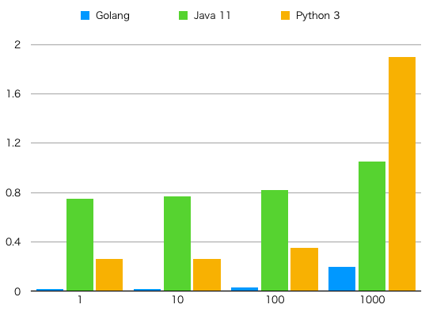

mqtt benchmarks
===============

Compare MQTT client performance for Go, Java and Python.

## Summary

### Implementations

| Lang/Runtime   | MQTT Library            | Counting method |
| -------------- | ----------------------- | --------------- |
| Golang 1.11.4  | Paho MQTT Golang v1.1.1 | Channel         |
| OpenJDK 11.0.1 | Paho MQTT Java v1.2.0   | CountDownLatch  |
| Python 3.6.5   | Paho MQTT Python v1.4.0 | GIL             |

### Measurement method

```
/usr/bin/time -lp <command> <n>
```

Using `real` as time and `maximum resident set size` as memory usage.

## Result

Memory usage (Unit: Bytes):

| Volume | Golang   | Java 11   | Python 3 |
| ------ | -------- | --------- | -------- |
|      1 |  8466432 |  69382144 | 12337152 |
|     10 |  8396800 |  69713920 | 12210176 |
|    100 |  8548352 |  68845568 | 12349440 |
|   1000 |  9494528 |  70881280 | 12242944 |
|  10000 | 12722176 |  94748672 | 12500992 |
| 100000 | 13000704 | 145399808 | 12267520 |


Time spent (Unit: Seconds):

| Volume | Golang | Java 11 | Python 3 |
| ------ | ------ | ------- | -------- |
|      1 |   0.02 |    0.75 |     0.26 |
|     10 |   0.02 |    0.77 |     0.26 |
|    100 |   0.03 |    0.82 |     0.35 |
|   1000 |   0.20 |    1.05 |     1.90 |
|  10000 |   1.68 |	   2.20 |    17.89 |
| 100000 |  17.01 |	  17.08 |   178.13 |



## Programming

### Prerequisites

- Golang 1.11 or higher
- JDK 11 or higher
- Python 3.5 or higher
- Python PIP via `pip3` command
- GNU Make
- `/usr/bin/time` (not a bash built-in)

### Run

Build binary / JAR:

```
./bench.sh build
```

Run loader:

```
./bench.sh loader
```

Run implementations (volume=100):

```
./bench.sh g 100
./bench.sh j 100
./bench.sh p 100
```
