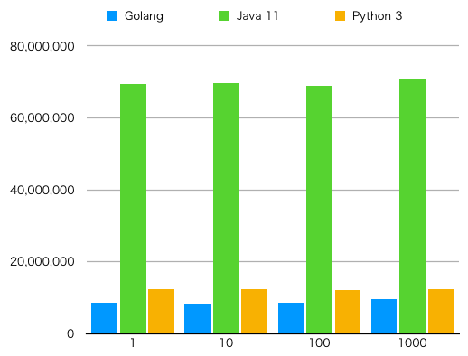

mqtt benchmarks
===============

Compare MQTT client performance for Go, Java and Python.

## Summary

### Implementations

| Lang/Runtime   | MQTT Library            | Counting method |
| -------------- | ----------------------- | --------------- |
| Golang 1.11.4  | Paho MQTT Golang v1.1.1 | Channel         |
| OpenJDK 11.0.1 | Paho MQTT Java v1.2.0   | CountDownLatch  |
| Python 3.6.5   | Paho MQTT Python v1.4.0 | GIL             |

### Measurement method

```
/usr/bin/time -lp <command> <n>
```

Using `user` as time and `maximum resident set size` as memory usage.

## Result

Memory usage (Unit: Bytes):

| Volume | Golang   | Java 11   | Python 3 |
| ------ | -------- | --------- | -------- |
|      1 |  8368128 |  69263360 | 12496896 |
|     10 |  8433664 |  69197824 | 12431360 |
|    100 |  8527872 |  69111808 | 12386304 |
|   1000 |  9490432 |  70500352 | 12242944 |
|  10000 | 12742656 |  93679616 | 12480512 |
| 100000 | 12918784 | 144687104 | 12320768 |



Time spent (Unit: Seconds):

| Volume | Golang | Java 11 | Python 3 |
| ------ | ------ | ------- | -------- |
|      1 |   0.01 |    1.26 |     0.11 |
|     10 |   0.01 |    1.29 |     0.12 |
|    100 |   0.02 |    1.35 |     0.14 |
|   1000 |   0.16 |    1.78 |     0.42 |
|  10000 |   1.61 |	   3.74 |     3.23 |
| 100000 |  15.12 |	  14.39 |    30.48 |


## Programming

### Prerequisites

- Golang 1.11 or higher
- JDK 11 or higher
- Python 3.5 or higher
- Python PIP via `pip3` command
- GNU Make
- `/usr/bin/time` (not a bash built-in)

### Run

Build binary / JAR:

```
./bench.sh build
```

Run loader:

```
./bench.sh loader
```

Run implementations (volume=100):

```
./bench.sh g 100
./bench.sh j 100
./bench.sh p 100
```
